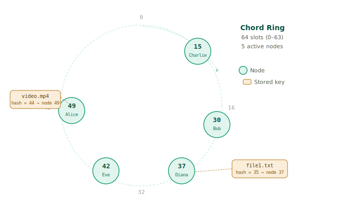
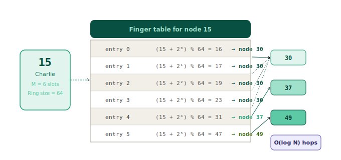
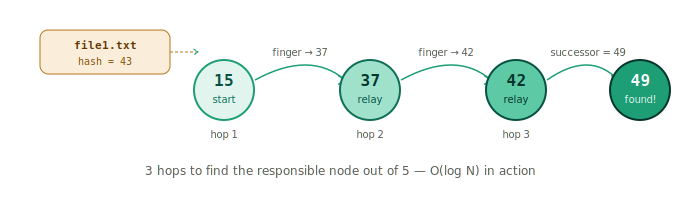
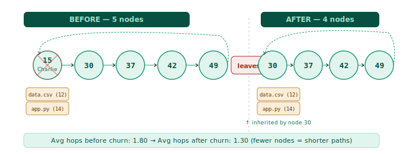
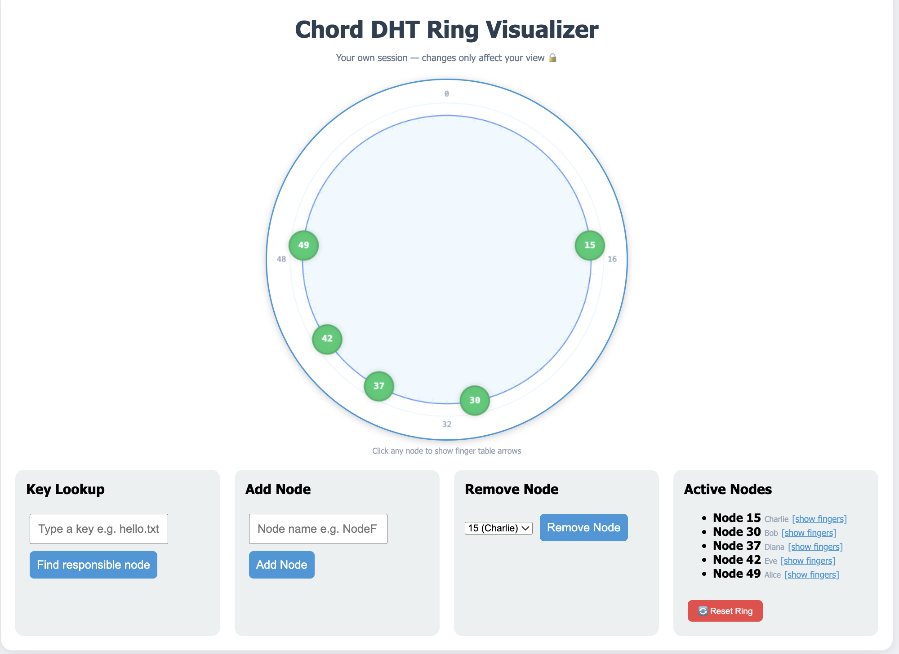

# chord-dht

A simulation of the Chord DHT protocol written in Python. Nodes sit on a logical ring, keys get hashed to positions on that ring, and lookups hop between nodes using finger tables instead of asking everyone one by one.

We built this in 6 days for a university course. It has a CLI demo and a web interface you can actually click around in.

---

## How it works

Every node and every key gets a number between 0 and 63 (via SHA-1). Imagine those numbers arranged in a circle. A key belongs to whichever node comes first clockwise from it.

Without any optimization that means finding a key could take O(N) hops — you'd ask node after node until you land on the right one. Finger tables fix this. Each node keeps 6 shortcuts: pointers to nodes at positions +1, +2, +4, +8, +16, +32 ahead. That gets you to O(log N) hops.

When a node leaves, its keys go to the next node clockwise and the finger tables rebuild. That's churn.









---

## Setup

```bash
git clone https://github.com/bytepharaoh/chord-dht.git
cd chord-dht
pip3 install flask flask-session
pip3 install -e .
```

---

## Running it

**CLI demo** — shows the full ring, inserts 10 keys, runs lookups, removes a node, prints stats:

```bash
PYTHONPATH=. python3 main.py
```

**Web interface** — interactive, runs in your browser:

```bash
PYTHONPATH=. python3 server.py
```

Then go to http://127.0.0.1:8010

Each browser session gets its own ring so multiple people can use it at the same time without stepping on each other.

---

## Web interface



You can type a key and see which node is responsible for it, with the full hop path drawn on the ring. Click any node to see its finger table as arrows on the ring. Add or remove nodes and watch the ring update live. There's also a reset button if things get messy.

---

## What the output looks like

```
=== Ring Structure ===
 [.] -- [.] -- [15] -- [.] -- [30] -- [.] -- [37] -- [42] -- [49] -- [.]

=== Key Lookups (BEFORE churn) ===
Key 'file1.txt'  (hash=43) → node 49 | hops: [15, 37, 42]
Key 'photo.jpg'  (hash=25) → node 30 | hops: [15]
Key 'data.csv'   (hash=12) → node 15 | hops: [15]

=== Churn: Removing Charlie (node 15) ===
30 -> 37 -> 42 -> 49 -> (wrap)

=== Routing Stats ===
Avg hops BEFORE churn: 1.80
Avg hops AFTER  churn: 1.30
```

---

## Project layout

```
chord-dht/
├── chord/
│   ├── node.py           # the ring, nodes, and hashing
│   ├── finger_table.py   # builds finger tables
│   ├── routing.py        # the lookup algorithm
│   ├── logger.py         # event logging
│   ├── visualizer.py     # text ring display
│   ├── templates/
│   │   └── ring.html
│   └── static/
│       ├── script.js
│       └── style.css
├── docs/                 # diagrams
├── main.py               # CLI demo
├── server.py             # web interface
└── tests/
    └── test_ring.py
```

---

## Team

| | |
|---|---|
| Ziad Mohamed | project lead, ring core, hashing, integration |
| Egor Maiorov | finger table construction |
| Mikhail Tikhonov | routing algorithm |
| Kamil Khusnutdinov | logging, tests, churn simulation |
| Artem Ulianov | visualizer, web interface, report, slides |

---

*Distributed and Network Programming — Innopolis University, April 2026*
